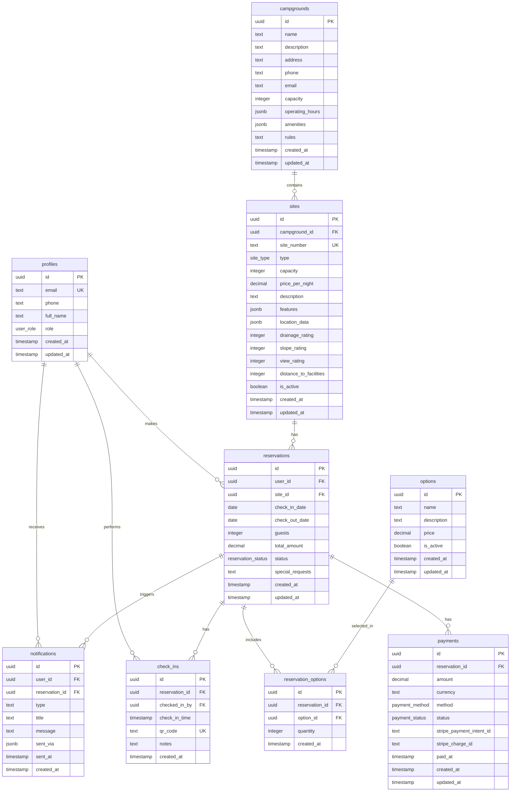

# キャンプ場予約システム - データベース設計

## ER図

## テーブル詳細

### 主要エンティティ

#### profiles (ユーザー情報)
- Supabase Auth と連携
- ロールベースアクセス制御（user/admin/manager）

#### campgrounds (キャンプ場)
- 基本情報と設備情報
- JSONB で柔軟なデータ構造

#### sites (サイト)
- 各キャンプ場の区画情報
- 詳細な評価データ（水はけ・傾斜・景観）
- 位置情報と設備情報

#### reservations (予約)
- 予約の核心データ
- 日付重複チェック必須
- ステータス管理

#### options (オプションサービス)
- アーリーチェックイン、ペット料金など
- 動的価格設定

### 関係テーブル

#### reservation_options (予約オプション)
- 多対多関係の解決
- 数量指定可能

#### payments (決済)
- Stripe 統合用
- 複数決済方式対応

#### check_ins (チェックイン)
- QRコード対応
- チェックイン履歴

#### notifications (通知)
- メール/LINE 通知管理
- 送信履歴追跡

## セキュリティ設計

### Row Level Security (RLS)
- ユーザー：自身のデータのみアクセス
- 管理者：全データアクセス
- 公開データ：キャンプ場・サイト情報

### ビジネスルール
- サイト重複予約防止
- 金額計算関数
- 在庫チェック関数

## パフォーマンス最適化

### インデックス
- 日付範囲検索用インデックス
- ステータス検索用インデックス
- 外部キーインデックス

### パーティショニング検討
- 大規模化時の予約テーブル分割
- 時系列データのパーティション